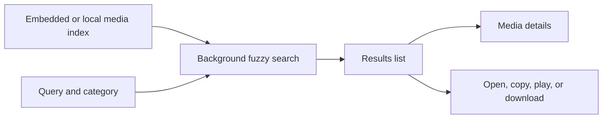
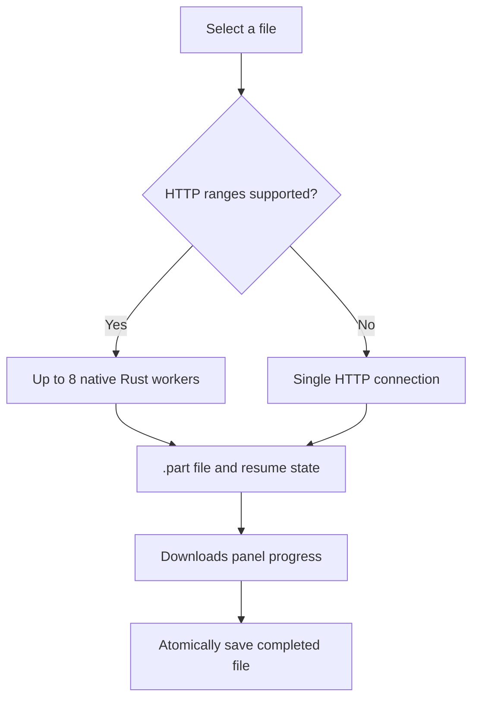

# SAM-FUZZY ◈ SamOnline Millisecond Media Explorer

[](https://github.com/Shantodotdev/sam-fuzzy/actions/workflows/ci.yml)
[](https://github.com/Shantodotdev/sam-fuzzy/releases)
[](LICENSE)
[](https://www.rust-lang.org/)
[]()

A fast terminal media explorer for browsing, fuzzy-searching, streaming, and downloading SamOnline (DhakaFlix) media.

Built with Rust and Ratatui, with a focused pink/maroon terminal interface.

---

## Quick Installation

### Linux & macOS

Install the latest standalone binary:

```bash
curl -fsSL https://raw.githubusercontent.com/Shantodotdev/sam-fuzzy/main/install.sh | bash
```

### Standalone binaries

Each release includes the media index inside the binary—no data folder is required.

| Operating System | Architecture | Binary Type | Direct Download |
|---|---|---|---|
| **Windows** | x86_64 (Windows 10/11) | Executable (`.exe`) | [Download `sam-fuzzy-windows-x86_64.exe`](https://github.com/Shantodotdev/sam-fuzzy/releases/latest/download/sam-fuzzy-windows-x86_64.exe) |
| **macOS** | Apple Silicon (M1/M2/M3/M4) | Executable (Mach-O) | [Download `sam-fuzzy-macos-arm64`](https://github.com/Shantodotdev/sam-fuzzy/releases/latest/download/sam-fuzzy-macos-arm64) |
| **Linux** | x86_64 | Executable (ELF) | [Download `sam-fuzzy-linux-x86_64`](https://github.com/Shantodotdev/sam-fuzzy/releases/latest/download/sam-fuzzy-linux-x86_64) |

---

## What it does

- Search a built-in index of 100k+ media items with category filters and natural sorting.
- Open a selected title in the browser, copy its URL, or send it to MPV/VLC.
- Download files with live progress, cancellation, and resume support.
- Use up to eight native Rust HTTP range workers per file when the mirror supports them.
- Keep the search results, media details, downloads, and shortcuts visible in one TUI.

---

## How it works

The compressed media index is embedded in the release binary. You can replace it with a newer local dataset using `--data`.



Search first rejects impossible matches with a small character mask, then scores the remaining items in parallel before the TUI redraws.

### Download flow



Cancelled downloads keep their partial data and resume state. The app never needs a separate download manager.

---

## Keyboard Shortcuts

| Key | Action |
|---|---|
| `Enter` | **Open in default web browser** (stream / DhakaFlix player) |
| `Alt + C` / `F2` / `Ctrl + Y` | **Copy direct URL** to system clipboard (in Search focus) |
| `Alt + P` / `F3` | **Stream in MPV / VLC** external player |
| `Alt + D` / `F6` | **Download selected file** and open the live progress manager |
| `F7` | Show or hide the bottom **Downloads** progress panel |
| `Ctrl + W` | Switch focus between **Search** and **Downloads** panes |
| `Alt + J` / `Alt + K` | Navigate the focused pane (results or downloads) |
| `Alt + C` / `F8` | Cancel selected download in Downloads focus (keeps its `.part` file) |
| `Alt + F` / `F4` | **Open parent folder** in browser |
| `Alt + S` / `F5` / `Alt + I` | **Toggle sidebar** (details / inspector panel) |
| `Tab` / `Shift + Tab` | Switch category tabs |
| `↑` / `↓` (`Ctrl + P` / `Ctrl + N`) | Navigate search results |
| `PageUp` / `PageDown` | Scroll results page-by-page |
| `Home` / `End` | Jump to top / bottom of results |
| `Ctrl + U` | Clear search query |
| `Esc` | Clear query or quit |
| `Ctrl + C` / `Ctrl + D` | Quit application |

---

## Building from Source

### Prerequisites

- [Rust toolchain](https://www.rust-lang.org/tools/install) (2024 edition or 1.85+)
- Optional: `mpv` or `vlc` for external video streaming

### Running the Optimized Release Binary

```bash
cargo run --release
```

Or build and execute the binary directly:
```bash
cargo build --release
./target/release/sam-fuzzy
```

### CLI Options

```text
Usage: sam-fuzzy [OPTIONS]

Options:
  -d, --data <DATA>          Custom path to dataset (.json or .json.gz)
  -q, --query <QUERY>        Initial search query (e.g. -q "witcher")
  -c, --category <CATEGORY>  Initial category filter (e.g. -c "Korean")
  -o, --downloads-dir <DIR>  Directory used for downloaded media (default: platform Downloads folder)
  -h, --help                 Print help
  -V, --version              Print version
```

### Downloads

Downloads run entirely inside the Rust binary. Mirrors with HTTP range support use 4 MiB chunks and up to eight connections; other mirrors use one connection. Finished chunks are recorded beside the temporary `.part` file, and completed files are atomically saved into the destination folder.

Press `Ctrl+W` to focus Downloads, navigate with `Alt+J` / `Alt+K`, and cancel the selected transfer with `Alt+C` or `F8`. Partial data stays available for resume.

---

## Automation

- CI checks formatting, Clippy, and tests on Linux, macOS, and Windows.
- Releases build binaries for Linux, macOS, and Windows.
- A scheduled workflow refreshes and validates the media index.

---

## Testing

Run the full test suite:

```bash
cargo test --all-targets
```

CI also runs `cargo fmt --check` and strict Clippy.

---

## License

This project is licensed under the MIT License - see the [LICENSE](LICENSE) file for details.

Copyright (c) 2026 KR Shanto
